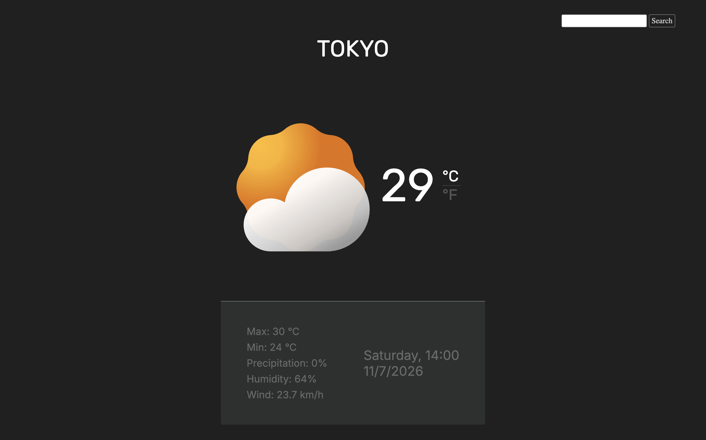

# Weather App

A weather forecast app that lets you search any location and view its current data, fetched from the Visual Crossing API.

🔗 [Live Demo](https://weather-app-lemon-gamma-74.vercel.app/)

## Screenshot

## Features

- Search weather by city, with error message for invalid input
- Toggle between Celsius/km-h and Fahrenheit/mph
- Weather icon changes dynamically based on current conditions (via dynamic imports)
- Displays temperature, max/min, precipitation, humidity, wind and local date/time
- Loading state on initial page load

## Built with

- HTML
- CSS
- JavaScript
- Visual Crossing API
- Luxon
- Webpack